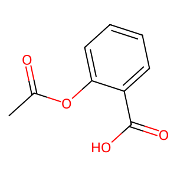

# ChemStruct
For getting Chemical Structure with PubChemPy and RDKit
# Visual Studio CodeでPubChemPyを使って構造式を取得する

## はじめに

### PubChemPyのインストールにあたって

今回, パッケージインストールには`pip`コマンドを使用します
```shell
$ pip install pubchempy
Command 'pip' not found, but can be installed with:
sudo apt install python3-pip
```
と出たときは
```shell
$ sudo apt update
$ sudo apt install python3-pip
```
と入力してpipをインストールしましょう<sup>1)</sup>.

### Ubuntu環境でのPythonファイル実行

今回はPython3をインストールしているので, Pyhtonファイルの実行は
```shell
$ python3 hogehoge.py
```
になります<sup>3)</sup>.

## モジュールのインストール
pipをインストールしてpipコマンドが使用できるようになったので, 早速構造式を取得するのに必要なモジュールをインストールしていきます.
今回は`PubChemPy`と`RDKit`をインストールする必要があるので
```shell
$ pip install pubchempy
$ pip install rdkit
```
と入力してPubChemPyパッケージとRDKitパッケージをインストールしましょう<sup>1,4)</sup>.

## PubChemPyで構造式を取得する
いよいよ本題です.
構造式の取得には`Draw.MolToImage(molecule)`が用いられます.
```
molecule = Chem.MolFromSmiles('[SMILES]')
Draw.MolToImage(molecule)
```
変数moleculeにはCanonical SMILESのデータを分子情報に変換して代入しています.
今回はアスピリン(アセチルサリチル酸)の構造式を取得します.
```python
import pubchempy as pcp
from rdkit import Chem
from rdkit.Chem import Draw

# アスピリンの構造を取得
aspirin = Chem.MolFromSmiles('CC(=O)OC1=CC=CC=C1C(=O)O')
Draw.MolToFile(aspirin, 'aspirin.png')
```
このファイルを実行して得られた`aspirin.png`は以下のようになります.  


## あとがき

今年半ばに実験にてPubChemPyに触れたっきりだったので記事を書くのにも意外と時間がかかって しまいましたが, 誰かの参考になれば嬉しいです.
また, 分子間の関係について書く機会があれば, またその時に続きの記事を書きます.

## 参考ドキュメント
1. 化学の新しいカタチ 化合物データベースPubChemをpythonで使いこなす
    https://future-chem.com/pub-chem-py/
1. Pythonマニア Ubuntuにpipコマンドがない | インストール方法や注意点を解説します
    https://pythonmaniac.com/ubuntu-pip/#index_id2
1. OFFICE54 【Ubuntu】Pythonの実行方法：スクリプトやコマンドによる実行について
    https://office54.net/iot/linux/ubuntu-python-run#google_vignette
1. 化学の新しいカタチ RDKitでケモインフォマティクスに入門
    https://future-chem.com/rdkit-intro/#toc4